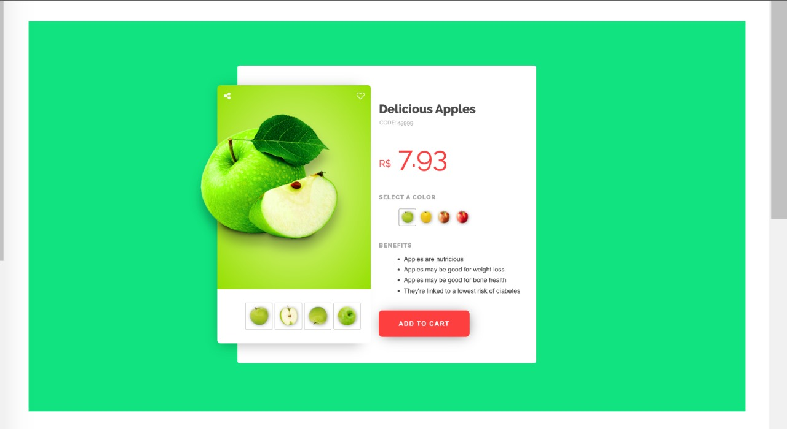

# Delicious Apples Showcase

Welcome to the Delicious Apples Showcase project! This simple web page aims to showcase delicious apples in an aesthetically pleasing and user-friendly manner. Below, you'll find details on how to set up and use this project.

## Table of Contents

1. [Introduction](#introduction)
2. [Installation](#installation)
3. [Usage](#usage)
4. [Features](#features)
5. [File Structure](#file-structure)
6. [Dependencies](#dependencies)
7. [Contributing](#contributing)
8. [License](#license)

## Introduction

The Delicious Apples Showcase is a web page built with HTML, CSS, and a touch of JavaScript to display information about a variety of apples. It provides a visual representation of different apple images, allows users to choose apple colors, and presents information about the benefits of consuming apples.

## Screenshot


## Installation

To use this project locally, follow these steps:

1. Clone the repository to your local machine:

   ```bash
   git clone https://github.com/your-username/delicious-apples-showcase.git

1. Open the project folder:

    ```bash
    cd delicious-apples-showcase

3. Open the `index.html` file in your preferred web browser.

## Usage

The web page presents a delightful showcase of apples with interactive features. Users can explore various apple images, select different colors, and learn about the benefits of consuming apples. Additionally, a "Add to Cart" button is provided for a potential e-commerce integration.

## Features
Responsive design for various screen sizes.
Interactive photo album for exploring different apple images.
Color selection option for apples.
Information on the benefits of consuming apples.
Add to Cart button for potential e-commerce integration.

## File Structure
The project consists of the following main files and directories:

- index.html: The main HTML file.
- style.css: The stylesheet defining the project's visual style.
- script.js: The JavaScript file for any additional interactivity.
Dependencies
This project utilizes the following external dependencies:

- Material Icons: For icons used in the web page.
Contributing
If you'd like to contribute to this project, please follow the Contribution Guidelines.

### License
This project is licensed under the MIT License. Feel free to use, modify, and distribute the code for your own purposes.


<div>
<h3 align="center">❤️Thank You 😎</h3>

<div align="center">
  <p>😊Thank you for checking out my project!</p>
  
  <h4 style='color: aquamarine;'>👻 Happy Coding 🍏✨</h4>
  <p>🥳Your support means a lot to me. If you have any questions or feedback, feel free to reach out.</p>
</div>

</div>